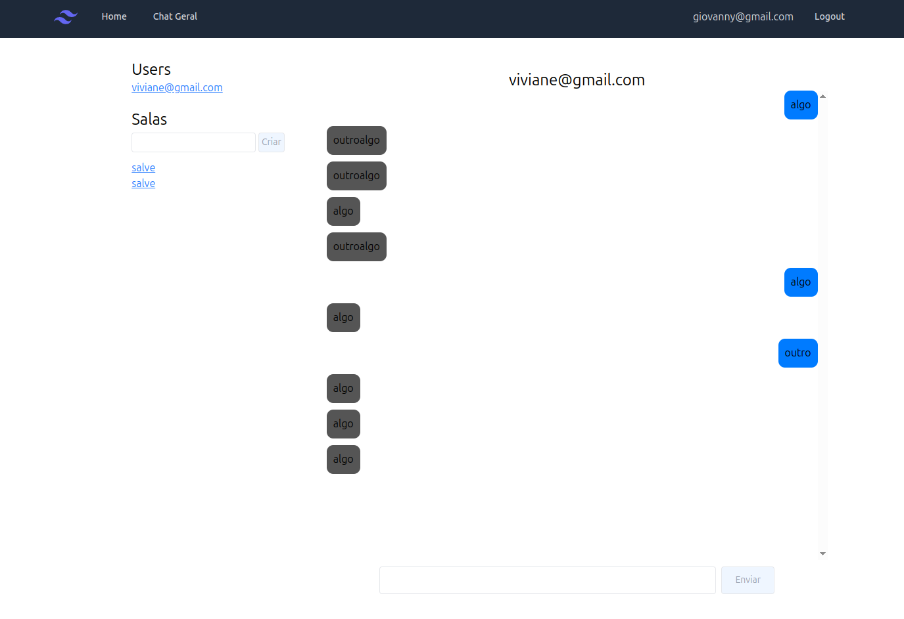
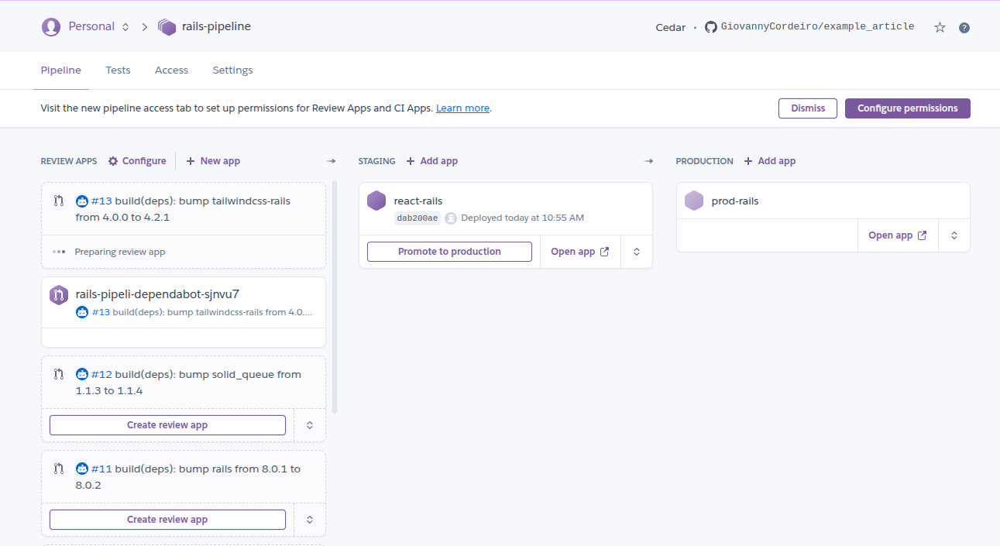

# Teste tecnico - Toolzz

Olá, sou o Giovanny. Agradeço desde já o convite para participar do teste tecnico!
Confesso que este teste técnico foi bastante desafiador, pois nunca havia desenvolvido
um projeto de chat semelhante. No entanto, como já era um dos meus planos, fiquei feliz
e animado com a oportunidade. O prazo foi curto, apenas 2 dias, mas a cada etapa do
desenvolvimento da aplicação, sentia-me mais satisfeito ao compreender o funcionamento de cada parte.

## 👨‍💻 Preview da aplicação!

## 📋 Tabela de conteudos:
- Funcionalidades desenvolvidas
- Setup do projeto
- Requisitos
- Setup do projeto
- Decisoes tecnicas e aplicacoes
- Melhorias

## 🎯 Funcionalidades desenvolvidas:

- ✅ Chat de salas para todos usuarios
- ✅ Chat direct entre usuarios
- ✅ Autentitacao e autorizacao
- ✅ Pipeline de CI

## Requisitos
- Docker

## 🌐 Setup do projeto:

- Abra o docker ou execute o docker em sua maquina
- Abra o projeto no vscode
- Execute em containers de desenvolvimento por meio de uma mensagem a direita que vai aparecer no proprio Vscode.
- Espere o projeto rodar devidamente
- Rode no terminal o comando `rails db:migrate`
- Rode no terminal o comando `rails s`

## 📝 Decisões Técnicas e Aplicações:

Devido ao prazo bastante curto, optei por não desenvolver a parte frontal utilizando React. Embora já tenha
trabalhado com React em outros projetos disponíveis no meu GitHub, avaliando o tempo limitado, percebi que abstrair
e conectar o front-end com uma API Rails poderia consumir um tempo precioso. Assim, decidi focar em uma arquitetura
monolítica, empregando Hotwire e Tailwind CSS de forma direta, aproveitando as vantagens do ecossistema Rails.​

O desafio foi complexo devido aos requisitos estabelecidos, mas desenvolver um projeto com Ruby on Rails é sempre
gratificante, especialmente pelos seus padrões de convenção sobre configuração e pelos princípios SOLID.​

Adotei commits semânticos para documentar claramente o histórico de alterações. Essa prática facilita a identificação
de versões com possíveis bugs, agilizando o processo de depuração.

## 💡 Melhorias:

- Melhor desenvolvimento de componentes utilizando Stimullus + React: Senti que aplicação não tinha um
dos principais fatores que era uma UX interessante, mas o desenvolvimento das funcionalidades não seriam em vão
justamente pela integração facil entre Stimulus e componetes react, distribuindo componentes quando
necessario de forma rapido, tirando vantagem do ecossistema Javascript pode trazer, com a praticidade do rails, como
[descrito nesse artigo](https://blog.codeminer42.com/rails-stimulus-react/)

- Refinamento do mobile first para desenvolvimento de forma clara e objetiva: As telas não estão desenvolvidas
para mobile first, embora na maioria dos projetos eu desenvolva dessa forma, por conta do tempo acabei não impelmentando
o que acredito ser um infelicidade minha, por isso, com mais tempo implementaria responsividade
seguindo abordagem modernas do desenvolvimento front-end, onde deixamos os elementos se reagirem
as varias proporcoes de tela, como descrito [nesse artigo aqui](https://dev.to/lixeletto/acho-que-ja-podemos-deixar-o-mobile-first-em-2024-3m61)

- Pipeline Stage e Deploy: Por meio do Heroku definiria uma pipeline de entrega continua de funcionalidades para QAs e devs,
o que facilitaria ainda mais o processo de entrega continua de software, promovendo um ambiente ainda mais proximo de
produção e desenvolvimento, isso evitaria erros de código que quebrem o sistema com novas atualizações e melhoraria
a produtividade. Segue o exemplo de uma pipeline que já construi:

- Melhora da escalabilidade: A medida que fosse me aprofundado como se da o funcionamento do processo
de caching e escala de aplicações
